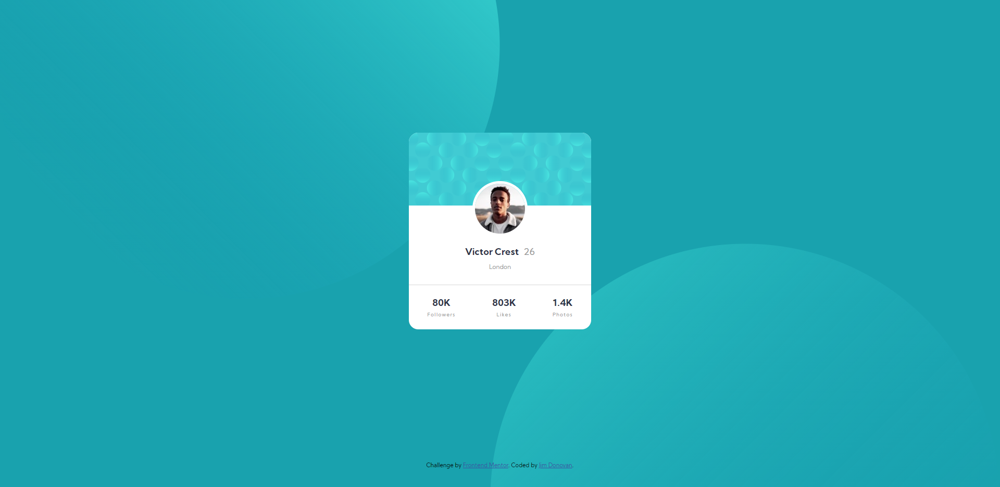

# Frontend Mentor - Profile card component solution

This is my solution to the [Profile card component challenge on Frontend Mentor](https://www.frontendmentor.io/challenges/profile-card-component-cfArpWshJ). Please feel free to give me feedback.

## Overview

### The challenge

- Build out the project to the designs provided

### Screenshot

   
   

### Links

- Solution URL: [Add solution URL here](https://your-solution-url.com)
- Live Site URL: [https://jimovan.github.io/profile-card/](https://jimovan.github.io/profile-card/)

### Built with

- Semantic HTML5 markup
- CSS custom properties
- Flexbox

## Author

- Frontend Mentor - [@jimovan](https://www.frontendmentor.io/profile/jimovan)

## Acknowledgments

I used a few other submitted solutions for reference, mainly using Ellie's [solution](https://www.frontendmentor.io/solutions/profile-card-component-solution-EGxJlvhlr)
